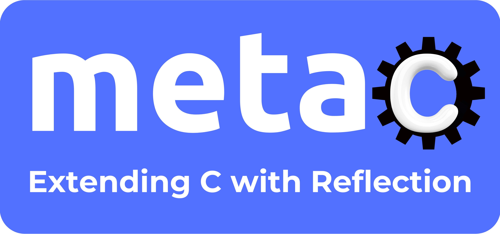

/* ``If you can't do it in
ANSI C, it isn't worth doing.''
-- Unknown */

A framework that extends C with **reflection** and some other related golang-like features.
Reflection implementation is based on [DWARF](https://en.wikipedia.org/wiki/DWARF) data - one of the most common debugging information formats used by debuggers like gdb or lldb. Metac/reflect offers a familiar API similar in many ways to [Golang/reflect](https://pkg.go.dev/reflect) package for introspecting code and manipulating data at runtime. 

**Features**:

* 'Deep' functionality for printing, copying, comparing, and freeing memory of complex data structures: [demo link](/doc/demo/README.md#how-to-demo).
* Supported on Ubuntu, macOS, Windows (msys2) with gcc or clang
